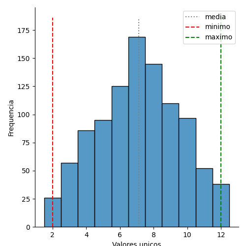

# Teste de hipótese

### Supondo um jogo justo (ou seja, todos os lançamentos são igualmente prováveis), o resultado da sua simulação coincide com essa suposição? Por que sim ou por que não?

Não. Pelos resultados apresentados pelo script projeto.py, notamos que os resultados não são equiprováveis. O histograma abaixo nos dá uma ideia mais visual:

Podemos notas que os valores entre 6 e 8 têm mais chances de ocorrer do que os demais.

Isso se dá por conta do espaço amostral:

|  |  |  |  |  |  |
|-------|-------|-------|-------|-------|-------|
| (1,1) | (1,2) | (1,3) | (1,4) | (1,5) | (1,6) | 
| (2,1) | (2,2) | (2,3) | (2,4) | (2,5) | (2,6) |
| (3,1) | (3,2) | (3,3) | (3,4) | (3,5) | (3,6) |
| (4,1) | (4,2) | (4,3) | (4,4) | (4,5) | (4,6) |
| (5,1) | (5,2) | (5,3) | (5,4) | (5,5) | (5,6) |
| (6,1) | (6,2) | (6,3) | (6,4) | (6,5) | (6,6) |

Podemos ver que a possibilidade da soma dos números de cada par ser entre 6 e 8 é maior para os demais.

As probabilidades esperadas são:

| Soma dos pares | Probabilidade esperada | 
| -------------- | ---------------------- |
|     2          | 2,7778% |
|     3          | 5,5556% |
|     4          | 8,3333% |
|     5          | 11,1111% |
|     6          | 13,8889% |
|     7          | 16,6667% |
|     8          | 13,8889% |
|     9          | 11,1111% |
|     10         | 8,3333% |
|     11         | 5,5556% |
|     12         | 2,7778% |

### 2. O que isso significa para um jogador do jogo de dados?

Significa que, caso o jogador de dados queira fazer uma aposta de maior probabilidade de acerto, deveria apostar na soma dos valores igual a 7, que é o valor esperado para o experimento.